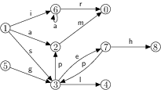

Vector-matrix multiplications
=============================

``` {.haskell}
{-# Language Rank2Types #-}
```

This document contains a slightly elaborated version of the code
presented in *Graph Problems and Vector-Matrix Multiplications in
Haskell*.

This module uses the separated modules

-   [`Semiring`](./Semiring.html) that contains the semiring type class
    and some exemplary instances and
-   [`RandomMatrix`](./RandomMatrix.html) that allows the creation of
    matrices that are generated randomly.

``` {.haskell}
module VMM where

import Control.Applicative              ( Applicative ( .. ) )
import Control.Arrow                    ( second, (&&&) )
import Control.Monad                    ( ap, liftM, MonadPlus ( .. ) )
import Control.Monad.ST.Lazy.Safe       ( ST, runST )
import Control.Monad.Trans.Class        ( lift )
import Control.Monad.Trans.Maybe        ( MaybeT ( .. ) )
import Data.Array.ST                    ( STArray, writeArray, readArray, newArray )
import Data.Char                        ( chr )
import Data.Function                    ( on )
import Data.List                        ( groupBy, sortBy, intercalate )
import Data.Maybe                       ( catMaybes )
import Data.Ord                         ( comparing )
import Data.Sequence                    ( Seq, (|>), empty )
import Data.Tree                        ( Tree ( Node ), Forest )
```

``` {.haskell}
import Semiring
import RandomMatrix
```

Preliminaries
=============

The basic data types for the described framework.

``` {.haskell}
type Vertex   = Int
type Arc a    = (Int, a)
newtype Vec a = Vec { unVec :: [Arc a] }
```

A pretty-printing `Show`-instance for vectors.

``` {.haskell}
instance Show a => Show (Vec a) where

 show (Vec ixs) = foldr showElem "" ixs
   where showElem (i, x) ixs = unwords ["(", show i, "|", show x, ")", ixs]
```

The `Functor` instance maps the given function over every value (i.e.
second component) in the association list.

``` {.haskell}
instance Functor Vec where

 fmap f = Vec . map (second f) . unVec
```

For example we have the following result:

-   `fmap chr (Vec [(2, 109), (3, 97), (5, 112)]) == Vec [(2, 'm'), (3, 'a'), (5, 'p')]`

We use the constant `emptyVec` for abbreviation.

``` {.haskell}
emptyVec :: Vec a
emptyVec = Vec []
```

This function checks whether the wrapped association list of a vector is
empty.

``` {.haskell}
isEmptyVec :: Vec a -> Bool
isEmptyVec = null . unVec
```

For simplicity of implementation and testing we define conversion
functions between sets of vertices and vectors. To obtain a vector from
a list of arcs, we need to sort the arcs with respect to their first
components and remove all duplicates. We keep only the first occurrence
of any value.

``` {.haskell}
mkVec :: [Arc a] -> Vec a
mkVec = Vec . map head . groupBy ((==) `on` fst) . sortBy (comparing fst)
```

To get a vector from a list of vertices, we need a function that creates
a value for each vertex.

``` {.haskell}
toVecFrom :: (Vertex -> a) -> [Vertex] -> Vec a
toVecFrom f = mkVec . map (id &&& f)
```

Using the same value for every vertex is the simplest case.

``` {.haskell}
toVecWith :: a -> [Vertex] -> Vec a
toVecWith = toVecFrom . const
```

Using `()` as a specific value is realised as follows.

``` {.haskell}
toVec :: [Vertex] -> Vec ()
toVec = toVecWith ()
```

Finally, using a `one` of some semiring is useful in an algebraic
context.

``` {.haskell}
toVec1 :: Semiring s => [Vertex] -> Vec s
toVec1 = toVecWith one
```

Transforming back from a vector is simple, since only the values need to
be removed.

``` {.haskell}
fromVec :: Vec a -> [Vertex]
fromVec = map fst . unVec
```

Set operations on vectors
-------------------------

Set operations on vectors can be easily defined using a merging
technique similar to the one in `Data.IntMap`. To avoid boilerplate code
we parametrise merging as follows:

``` {.haskell}
mergeWith :: ([Arc b] -> [c])               -- ^ left list is empty
          -> ([Arc a] -> [c])               -- ^ right list is empty
          -> (Int -> a -> b -> [c] -> [c])  -- ^ equality case
          -> (Int -> a -> b -> [c] -> [c])  -- ^ left index is smaller than the right one
          -> (Int -> a -> b -> [c] -> [c])  -- ^ left index is larger than the right one
          -> [Arc a] -> [Arc b] -> [c]
mergeWith leftEmpty rightEmpty eq lt gt = go where

    go []                 jys                             = leftEmpty jys
    go ixs                []                              = rightEmpty ixs
    go l1@( (i, x) : ixs) l2@( (j, y) : jys ) | i == j    = eq i x y (go ixs jys)
                                              | i <  j    = lt i x y (go ixs l2)
                                              | otherwise = gt j x y (go l1 jys)
```

This function ignores the first three parameters and returns the fourth.

``` {.haskell}
constFourth :: a -> b -> c -> d -> d
constFourth _ _ _ = id
```

This function computes the union of two vectors applying the supplied
function in case of index equality.

``` {.haskell}
unionWith :: (a -> a -> a) -> Vec a -> Vec a -> Vec a
unionWith f (Vec xs) (Vec ys) = Vec (go xs ys) where

  go = mergeWith id id (\i x y r -> (i, f x y) : r) (\i x _ r -> (i, x) : r) (\i _ y r -> (i, y) : r)
```

``` {.haskell}
bigUnionWith :: (a -> a -> a) -> [Vec a] -> Vec a
bigUnionWith op = foldr (unionWith op) emptyVec
```

One simple instance of these union functions are the "left-biased union"
and its repeated application. The left-biased union takes the value at
the leftmost occurrence of an index.

``` {.haskell}
(\\/) :: Vec a -> Vec a -> Vec a
(\\/) = unionWith const
```

The repeated application is then the leftmost union that is just as
simple to define.

``` {.haskell}
leftmostUnion :: [Vec a] -> Vec a
leftmostUnion = bigUnionWith const
```

The intersection function for intersecting association lists using a
user supplied combination function. It is very similar to `zipWith`.

``` {.haskell}
intersectionWithKey :: (Int -> a -> b -> c) -> Vec a -> Vec b -> [c]
intersectionWithKey f (Vec xs) (Vec ys) = go xs ys where
  go = mergeWith (const []) (const []) (\i x y r -> f i x y : r) constFourth constFourth
```

One useful intersection instance is the "left-biased intersection" that
takes the left value in case the index is present in both vectors.

``` {.haskell}
(//\) :: Vec a -> Vec b -> Vec a
v //\ w = Vec (intersectionWithKey (\i x _ -> (i, x)) v w)
```

This function denotes set difference. Its "skew" type is due to the fact
that all values in its second argument are ignored, because only the
indices are being compared.

``` {.haskell}
(\\) :: Vec a -> Vec b -> Vec a
Vec xs \\ Vec ys = Vec (go xs ys) where
  go = mergeWith (const []) id constFourth (\i x _ r -> (i, x) : r) constFourth
```

Matrices and the multiplication generators
------------------------------------------

Matrices are wrapped in an additional newtype (contrary to the
definition in the paper) to allow a pretty-printing `Show` instance.

``` {.haskell}
newtype Mat a  = Mat { matrix :: Vec (Vec a) }

instance Show a => Show (Mat a) where

  show = intercalate "\n" . map (uncurry f) . unVec . matrix where
    f j r = unwords [show j, ":", show r]
```

Matrices also have a natural `Functor` instance that uses the
corresponding vector instance twice.

``` {.haskell}
instance Functor Mat where

    fmap f = Mat . fmap (fmap f) . matrix
```

Given a fixed value `x` this function provides a vector of vertices in
the matrix where the value at every index is `x`.

``` {.haskell}
verticesWith :: a -> Mat b -> Vec a
verticesWith x = fmap (const x) . matrix
```

The scalar multiplication function. In the call
`sMultWith times i x vec` the supplied "multiplication" `times` is
applied to the "uncurried scalar" `(i, x)` and then mapped over every
value in the vector `vec`.

``` {.haskell}
sMultWith :: (Int -> s -> t -> u)->  Int -> s -> Vec t -> Vec u
sMultWith mult i x = fmap (mult i x)
```

The actual vector matrix multiplication. It takes a generalised sum
(first argument), a generalised scalar multiplication (second argument),
a vector and a matrix and applies the sum function to the result of the
intersection of the vector with the matrix, which in turn is obtained
using the scalar multiplication function.

``` {.haskell}
vecMatMult :: ([u] -> v) -> (Int -> s -> Vec t -> u) -> Vec s -> Mat t -> v
vecMatMult bigsum sMult v m = bigsum (intersectionWithKey sMult v (matrix m))
```

Applications of the Multiplication Scheme
=========================================

Algebraic multiplication
------------------------

This function is the usual multiplication of a vector with a matrix in
the context of semirings.

``` {.haskell}
(.*) :: Semiring s => Vec s -> Mat s -> Vec s
(.*) = vecMatMult (bigUnionWith (.+.)) (sMultWith (\ _ x y -> x .*. y))
```

Assuming an additional `Eq` constraint we can define the predicates

``` {.haskell}
isZero :: (Semiring s, Eq s) => s -> Bool
isZero = (zero ==)
```

``` {.haskell}
isOne :: (Semiring s, Eq s) => s -> Bool
isOne = (one ==)
```

that check whether a semiring element is `zero` or `one`. Alternatively,
one can require these predicates to be part of the semiring type class.

This function removes all pairs from a vector whose value is `zero`.

``` {.haskell}
nonZero :: (Semiring s, Eq s) => Vec s -> Vec s
nonZero = Vec . filter (not . isZero . snd) . unVec
```

This is a variant of `(.*)` that uses algebraic laws to avoid zeroes in
the result vector as well as avoiding possibly unnecessary computations.

``` {.haskell}
(.**) :: (Semiring s, Eq s) => Vec s -> Mat s -> Vec s
(.**) = vecMatMult (nonZero . bigUnionWith (.+.)) sMult where
  sMult i s vec | isZero s  = emptyVec
                | isOne  s  = vec
                | otherwise = nonZero (sMultWith (\ _ x y -> x.*.y) i s vec)
```

Successors computation in different flavours.
---------------------------------------------

This function computes the successors of a set of vertices in a given
graph, where the graph is represented by its adjacency matrix.

``` {.haskell}
(.->) :: [Vertex] -> Mat a -> [Vertex]
v .-> m = fromVec (toVec v .*> m)
```

The actual multiplication is pseudo-Boolean: every performed
multiplication is essentially a multiplication by `one`.

``` {.haskell}
(.*>) :: Vec s -> Mat a -> Vec a
(.*>) = vecMatMult leftmostUnion (\ _ _ row -> row)
```

This is an algebraic version of the successor multiplication. The
underlying semiring needs to be idempotent, i.e. `x .+. x == x` for all
`x :: s`.

``` {.haskell}
(.->*) :: Semiring s => [Vertex] -> Mat s -> [Vertex]
(.->*) v m = fromVec (toVec1 v .* m)
```

The above function `(.->*)` can be instantiated with a particular
idempotent semiring, e.g. the Boolean semiring.

``` {.haskell}
(.->>) :: [Vertex] -> Mat a -> [Vertex]
(.->>) v m = v .->* fmap (const (one :: Bool)) m
```

Successors that know the number of their predecessors
-----------------------------------------------------

This function computes the successors of a vertex set and counts the
number of times each successor is encountered as well.

``` {.haskell}
(.#) :: [Vertex] -> Mat a -> Vec (Number Int)
v .# m = toVecWith 0 v .*# m
```

The underlying multiplication of this function is the following one. It
maps every value that is encountered in the adjacency list of a vertex
to `1` and then uses numerical addition to add the resulting ones.

``` {.haskell}
(.*#) :: Num a => Vec (Number a) -> Mat b -> Vec (Number a)
(.*#) = vecMatMult (bigUnionWith (+)) (sMultWith (\_ _ _ -> 1))
```

Existence of successors
-----------------------

This is a very simple instance of a scalar multiplication -- it ignores
the vertex and the value and merely checks whether the supplied vector
is non-empty.

``` {.haskell}
hasSuccsMul :: Vertex -> a -> Vec b -> Bool
hasSuccsMul _ _  = not . isEmptyVec
```

The following instance of a vector-matrix multiplications checks whether
the successor set of a given vector is non-empty.

``` {.haskell}
(.?) :: Vec a -> Mat b -> Bool
(.?) = vecMatMult or hasSuccsMul
```

Prolonging a single path
------------------------

Vertex paths are represented by a `Seq`.

``` {.haskell}
type Path = Seq Vertex
```

Given the adjacency matrix of a graph and a vector where each vertex is
labelled with a single path that leads to this vertex this
multiplication computes the successors of this vector and marks every
successor with a single path that leads to it as well.

``` {.haskell}
(.*~) :: Vec Path -> Mat a -> Vec Path
(.*~) = vecMatMult leftmostUnion pathMul
```

The scalar multiplication is applied to a vertex and its adjacency list
only, so any given path can be prolonged by simply additing the current
vertex to the end of this path.

``` {.haskell}
pathMul :: Vertex -> Path -> Vec a -> Vec Path
pathMul = sMultWith (\v path _ -> path |> v)
```

Prolonging all paths
--------------------

This multiplication prolongs all paths that lead to a target vertex by
exactly one step through the graph represented by the given matrix.

``` {.haskell}
(.*~~) :: Vec [Path] -> Mat a -> Vec [Path]
(.*~~) = vecMatMult allUnion pathsMul
```

The `allUnion` function collects all results in their order of
occurrence.

``` {.haskell}
allUnion :: [Vec [a]] -> Vec [a]
allUnion = bigUnionWith (++)
```

Similarly to the `pathMul` function, the following function prolongs all
paths instead of just one.

``` {.haskell}
pathsMul :: Vertex -> [Path] -> Vec a -> Vec [Path]
pathsMul = sMultWith (\ v ps _ -> map (|> v) ps)
```

Outgoing values
---------------

The following multiplication computes the successors of a vertex and
adds all predecessors and their corresponding values to the `Arc`-list
at the respective index.

``` {.haskell}
(.*||) :: Vec [Arc a] -> Mat a -> Vec [Arc a]
(.*||) = vecMatMult allUnion outMult
```

The essence of the above multiplication is this scalar multiplication,
which prepends the "current" vertex and the outgoing value to the given
list of vertex-value pairs.

``` {.haskell}
outMult :: Vertex -> [Arc a] -> Vec a -> Vec [Arc a]
outMult = sMultWith (\i ovs a -> (i, a) : ovs)
```

An unusual application of the above multiplication is the transposition
of a homogeneous matrix. We factor out the actual strategy in the
function `preTranspose`.

``` {.haskell}
preTranspose :: Vec [Arc a] -> Vec [Arc a] -> Mat a -> Mat a
preTranspose vs cols mat = Mat (fmap Vec ((vs .*|| mat) \\/ cols))
```

``` {.haskell}
transpose :: Mat a -> Mat a
transpose mat = preTranspose vertices vertices mat where
    vertices = verticesWith [] mat
```

It is possible to define a very similar function that computes the
transposition of a heterogeneous matrix by adding an additional `Int`
argument that denotes the number of columns. This number can then be
used in the "correction" step (application of `(\\/)`) to add the
correct number of columns.

``` {.haskell}
transposeHeterogeneous :: Int -> Mat a -> Mat a
transposeHeterogeneous cols mat = preTranspose vertices vertices' mat where
    vertices  = verticesWith [] mat
    vertices' = toVecWith [] [0 .. cols - 1]
```

Collecting the reachability forest
----------------------------------

Assuming that a vector is labelled with a reachability forest (from
another vector) at every index this multiplication computes the
reachability forest that is obtained by walking a single step through
the graph.

``` {.haskell}
(.*++) :: Vec (Forest Vertex) -> Mat a -> Vec (Forest Vertex)
(.*++) = vecMatMult allUnion fMult
```

The scalar multiplication labels every successor of a given vertex with
a forest starting in that vertex that leads to the successor. The
concatenation of all these forests is then the result and is computed
above by using `allUnion`.

``` {.haskell}
fMult :: Vertex -> Forest Vertex -> Vec a -> Vec (Forest Vertex)
fMult = sMultWith (\v forest _ -> [Node v forest])
```

An application of the above multiplication is the computation of the
reachability forest along shortest paths between two vertex sets, which
is provided by the following function.

``` {.haskell}
reachForest :: Vec a -> Vec b -> [Mat c] -> Vec (Forest Vertex)
reachForest a = shortestWith (.*++) (fmap (const []) a)
```

Reachability and Iterated Computations
======================================

Repeated application of (fitting) multiplication can be used to compute
reachability layers along shortest paths. The following function
computes the reachability layers in a breadth-first search (BFS)
fashion, disregarding the BFS order.

``` {.haskell}
reachWith :: (Vec a -> Mat b -> Vec a) -- multiplication that collects information
          -> Vec a                     -- start vector
          -> [Mat b]                   -- list of graphs traversed in every step
          -> [Vec a]
reachWith _   r [] = [r]
reachWith mul r gs = go r (verticesWith () (head gs)) where

    go v w | isEmptyVec v = []
           | otherwise    = v : go v' w' where
                    w' = w \\ v
                    v' = foldl mul v gs //\ w'
```

The reachability strategy can be used to compute the vector that
consists of the vertices that can be reached along shortest paths
between two vertex sets. Each of these vertices is labelled with the
information collected by the supplied multiplication.

``` {.haskell}
shortestWith :: (Vec a -> Mat c -> Vec a) -- multiplication that collects information
             -> Vec a                     -- start vector
             -> Vec b                     -- target vector
             -> [Mat c]                   -- list of graphs traversed in every step
             -> Vec a
shortestWith mul a b gs = head (dropWhile isEmptyVec (map (//\ b) (reachWith mul a gs)) ++ [emptyVec])
```

Maximal Set of Pairwise Disjoint Shortest Paths
===============================================

The computation of a maximal set of pairwise disjoint shortest paths
between two vertex sets is realised by computing the reachability forest
with the `reachForest` function and then pruning it with the following
strategy. If there is no tree left, there no path left in the forest. If
on the other hand there is a leftmost tree, check whether its root node
is visited. If it is, continue with the remainder of the forest. If it's
not, then visit this vertex. Next compute a path candidate. In case the
candidate is indeed a path, add the vertex to its end and obtain a path
in the graph. Otherwise continue searching in the remaining forest. The
candidate is the empty path in case the current subforest is empty,
since this means that the bottom of the forest has been reached and the
path found by the recursive call on the subforest otherwise.

``` {.haskell}
chop :: Forest Vertex -> MaybeT SetM Path
chop []               = mzero
chop (Node v ts : fs) = do b <- lift (contains v)
                           if b then chop fs
                                  else do lift (include v)
                                          fmap (|> v) candidate `mplus` chop fs

                          where candidate | null ts   = return empty
                                          | otherwise = chop ts
```

The actual disjoint paths function computes the reachability forest and
then prunes every single forest `[Node i f]` where
`(i, f) :: Arc (Forest Vertex)` is a vertex-value pair that is contained
in the result vector of `reachForest`. Finally, the monadic set that is
used for the computation is "left" and the resulting list of
`Maybe Path` values is transformed into a list of paths by `catMaybes`.

``` {.haskell}
disjointPaths :: Int      -- number of vertices in the graph(s)
              -> Vec a    -- start vector
              -> Vec b    -- target vector
              -> [Mat c]  -- list of traversed graphs in every step
              -> [Path]
disjointPaths n start end gs = catMaybes (process (reachForest start end gs)) where

    process = runNew n . mapM (runMaybeT . chop . return . uncurry Node) . unVec
```

Monadic set interface
---------------------

The following monadic set interface is very similar to the one in
[`Data.Graph`](http://hackage.haskell.org/package/containers-0.5.4.0/docs/Data-Graph.html).
and can be replaced with a pure set representation by `Data.IntSet`. All
of the definitions below are almost identical to the ones from
`Data.Graph`.

``` {.haskell}
newtype SetM a = Set { runSet :: forall s . STArray s Int Bool -> ST s a }

instance Monad SetM where

    return x = Set (const (return x))

    Set m >>= f = Set fun where
        fun arr = do x <- m arr
                     runSet (f x) arr

instance Functor SetM where
    fmap = liftM

instance Applicative SetM where
    pure  = return
    (<*>) = ap
```

Checks whether an index is contained in the set or not.

``` {.haskell}
contains :: Int -> SetM Bool
contains x = Set (`readArray` x)
```

Inserts the given index in the set.

``` {.haskell}
include :: Int -> SetM ()
include x = Set (\arr -> writeArray arr x True)
```

Produces the value associated with the given set. The `Int` denotes the
size of the set.

``` {.haskell}
runNew :: Int -> SetM a -> a
runNew n set = runST (newArray (0, n - 1) False >>= runSet set)
```

Example Matrices and Vectors
============================

Examples by hand
----------------

This is the matrix *A* from Section 3 of the paper:

``` {.haskell}
--     |0  1  1|
-- A = |0  0  1|
--     |0  2  0|
```

``` {.haskell}
matA :: Mat Int
matA = Mat $ Vec [(0, Vec [(1, 1), (2, 1)]),
                  (1, Vec [(2, 1)]),
                  (2, Vec [(1, 2)])]
```

``` {.haskell}
matB :: Mat Int
matB = Mat $ Vec [ (0, Vec [(1, 1), (2, 2)]),
                   (1, Vec [(2, 3)]),
                   (2, Vec [(1, 4)])
                 ]
```

Two arbitrary matrices.

``` {.haskell}
mat1 :: Mat (Number Integer)
mat1 = Mat $ Vec [(0, Vec [(3,  2),(5,  0)]),
                  (1, Vec [(0,  2),(3, 1),(5,  0)]),
                  (2, Vec [(0,  2),(1, -1),(5,  0)]),
                  (3, Vec [(5,  - 2) ] ) ,
                  (4, Vec []),
                  (5, Vec [(4, 1)])]

mat2 :: Mat Char
mat2 = Mat $ Vec [(0, Vec [(3,'g')]),
                  (1, Vec [(0,'z'),(4,'p'),(8,'n'),(9,'v')]),
                  (2, Vec [(2,'e'),(4,'b'),(7,'e')]),
                  (3, Vec [(4,'i')]),
                  (4, Vec [(4,'o')]),
                  (5, Vec [(4,'v'),(6,'x'),(8,'d'),(9,'r')]),
                  (6, Vec [(1,'y'),(2,'p'),(3,'f'),(4,'s'),(5,'b'),(6,'j')]),
                  (7, Vec [(3,'v'),(6,'f'),(9,'v')]),
                  (8, Vec [(2,'g'),(4,'m'),(5,'k'),(7,'w'),(8,'k')]),
                  (9, Vec [(0,'c'),(2,'a')])]
```

These two matrices are structurally identical, but the first one
contains `Char` values, while the second one contains only ones of the
type `Number Int`. These two correspond to the graphs *G'* and *G* from
Section 1.




``` {.haskell}
graphChar :: Mat Char
graphChar = Mat $ mkVec [(0, mkVec []),
                         (1, mkVec [(2,'a'),(3,'s'),(6,'i')]),
                         (2, mkVec [(0,'m')]),
                         (3, mkVec [(2,'p'),(4,'l'),(7,'e')]),
                         (4, mkVec []),
                         (5, mkVec [(3,'g')]),
                         (6, mkVec [(0,'r'),(6,'a')]),
                         (7, mkVec [(3,'p'),(8, 'h')]),
                         (8, mkVec [])]

graphNumber :: Mat (Number Int)
graphNumber = fmap (const 1) graphChar
```

These two vectors are structurally identical, but the first one contains
only `()` values and the second one contains only ones of the type
`Number Int`. Both are variants of the vector *v\_X* from Section 1.

``` {.haskell}
vec :: Vec ()
vec = toVec [1,2,6]

vecNumber :: Vec (Number Int)
vecNumber = fmap (const 1) vec
```

The following graphs are taken from the talk given at the TFP
conference.

``` {.haskell}
graphWithLabels :: Mat Char
graphWithLabels = Mat $ mkVec [(0, mkVec [(0, 'a'), (2, 'p'), (3, 'l')]),
                               (1, mkVec [(0, 'd'), (2, 'r')]),
                               (2, mkVec [(4, 'l')]),
                               (3, mkVec [(2, 'f'), (4, 'n'), (5, 'e')]),
                               (4, mkVec [(5, 'h')]),
                               (5, mkVec [(0, 'w'), (4, 'o')])]

graphWithoutLabels :: Mat (Number Int)
graphWithoutLabels = fmap (const 1) graphWithLabels

xVector :: Vec ()
xVector = toVec [2,3,0]

xVectorNumber :: Vec (Number Int)
xVectorNumber = fmap (const 1) xVector

yVector :: Vec (Number Int)
yVector = mkVec [(5,1), (2, -1)]
```

Random examples
---------------

Random matrices can be generated with the following function.

``` {.haskell}
randomMatrix :: Random a => Int     -- ^ random generator number
                        -> Int     -- ^ number of vertices
                        -> Double  -- ^ density between 0 and 1
                        -> (a, a)  -- ^ lower and upper bounds for the random values
                        -> Mat a
randomMatrix = matlikeToMat randomSquareMatLike
```

The following function takes a `MatLike a` value and transforms it into
an actual matrix.

``` {.haskell}
fromAssociationList :: MatLike a -> Mat a
fromAssociationList = Mat . Vec . map (second Vec)
```

For instance

``` {.haskell}
graphRandom1 :: Mat Char
graphRandom1 = randomMatrix 23571113 10 0.25 ('a', 'e')

graphRandom2 :: Mat (Number Int)
graphRandom2 = randomMatrix 12345 5 0.1 (0, 20)
```

The following function takes a random construction and produces a
matrix. It is used to "redefine" all generators to yield actual
matrices.

``` {.haskell}
matlikeToMat :: (StdGen -> Int -> Double -> (a, a) -> MatLike a)
             -> Int -> Int -> Double -> (a, a) -> Mat a
matlikeToMat generator rng size dens bnds =
    fromAssociationList (generator (mkStdGen rng) size dens bnds)
```

Creates diagonal matrices. The density refers to the density along the
diagonal, *not* to the complete matrix.

``` {.haskell}
randomDiagonalMatrix ::
    Random a => Int     -- ^ random generator
             -> Int     -- ^ number of rows and columns
             -> Double  -- ^ density (/0 <= d <= 1/)
             -> (a, a)  -- ^ lower\/upper bounds
             -> Mat a
randomDiagonalMatrix = matlikeToMat randomDiagonalLike
```

Creates lower triangle matrices. The density refers to the density in
the lower triangle block (including the diagonal) only, *not* to the
complete matrix.

``` {.haskell}
randomTriangleMatrix ::
    Random a => Int     -- ^ random generator
             -> Int     -- ^ number of rows and columns
             -> Double  -- ^ density (/0 <= d <= 1/)
             -> (a, a)  -- ^ lower\/upper bounds
             -> Mat a
randomTriangleMatrix = matlikeToMat randomTriangleLike
```

Creates strict lower triangle matrices, i.e. the diagonal is empty. The
density refers to the density in the strictly lower triangle block only,
*not* to the complete matrix.

``` {.haskell}
randomStrictTriangleMatrix ::
    Random a => Int     -- ^ random generator
             -> Int     -- ^ number of rows and columns
             -> Double  -- ^ density (/0 <= d <= 1/)
             -> (a, a)  -- ^ lower\/upper bounds
             -> Mat a
randomStrictTriangleMatrix = matlikeToMat randomStrictTriangleLike
```

This function creates a random vector. Internally it creates a
$1 \times n$ matrix, where $n$ is the supplied size value and transforms
it into a vector.

``` {.haskell}
randomVector ::
    Random a => Int    -- ^ random generator
             -> Int    -- ^ number of columns
             -> Double -- ^ density (/0 <= d <= 1/)
             -> (a, a) -- ^ lower\/upper bounds
             -> Vec a
randomVector rng size dens bnds =
    Vec (snd (head (randomMatLike (mkStdGen rng) 1 size dens bnds)))
```
